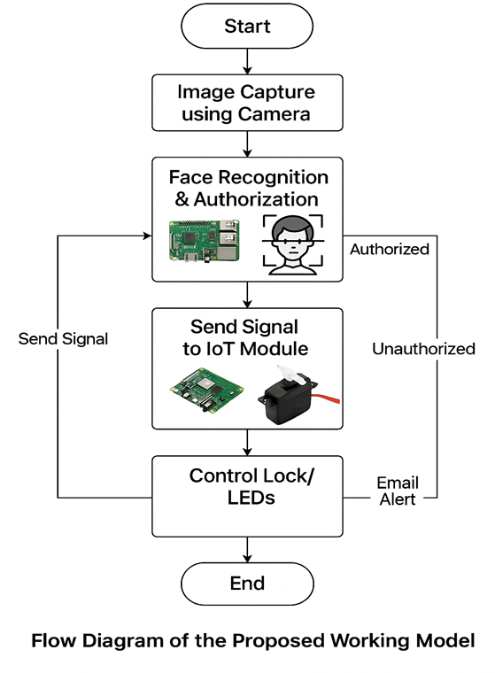
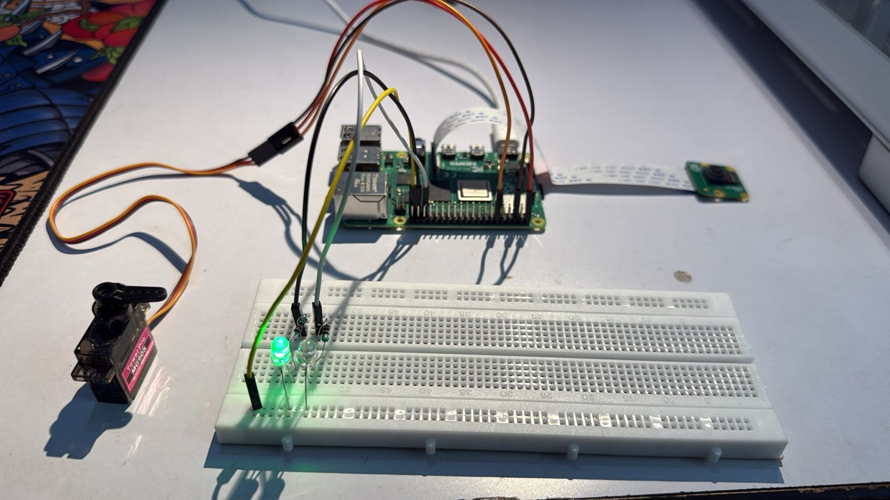
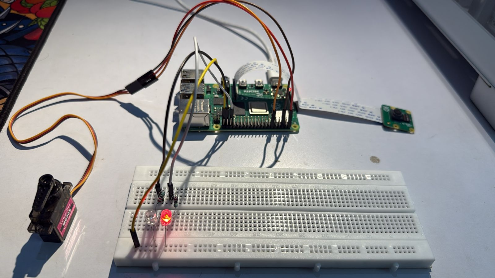

# Real-Time IoT Based Face Recognition and Authentication System

## 📌 Project Overview

This is my **Real-Time IoT-based Face Recognition and Authentication System**, designed to integrate **face recognition**, **email alerts**, **Adafruit IO dashboard**, and **servo motor control** to build a smart and secure access control solution. The system identifies faces live and grants or denies access accordingly, while sending instant notifications and updating the cloud dashboard.

## 🛠️ Key Features

* Real-time video streaming captured from Raspberry Pi camera.  
* Face recognition powered by the `face_recognition` Python library.  
* Automatic upload of images and access status to **Adafruit IO** feeds for monitoring.  
* Servo motor control to lock/unlock doors based on recognized identities.  
* Email alerts sent instantly for recognized and unrecognized faces.  
* LED indicators for immediate visual feedback (Green for access granted, Red for denied).  

---

### 📦 Installation Instructions

#### 🐍 Python Libraries (Cross-platform for Server & Client)

Install these packages on **both Windows and Raspberry Pi** (or any OS with Python):

```bash
pip install opencv-python face_recognition numpy adafruit-io Pillow
```

Raspberry Pi Specific Libraries (Client Only, Linux-based Raspberry Pi OS)
These libraries are only required on the Raspberry Pi client since they interface with hardware GPIO and Pi Camera:

```bash
sudo apt install python3-opencv
sudo pip3 install RPi.GPIO picamera2
```

### 📚 Dependency Overview

#### 📦 Common Python Libraries (Used on Both Server & Client)

- `opencv-python` – Image/video capture and processing.  
- `face_recognition` – Face detection and recognition (uses dlib).  
- `numpy` – Numerical operations and matrix handling (image buffers).  
- `adafruit-io` – Communicate with Adafruit IO dashboard (IoT integration).  
- `Pillow` – Image conversion and handling (e.g., saving frames).  
- `socket` – For real-time client-server communication.

---

#### 📡 Server-Side Only (Face Recognition Unit)

- `smtplib` & `email.message` – For sending real-time email alerts via SMTP for unknown face detection.

---

#### 🤖 Raspberry Pi Client-Specific (Hardware Integration)

> ⚠️ These libraries are **only required on the Raspberry Pi** client and will not work on Windows.

- `RPi.GPIO` – Controls GPIO pins to operate LEDs and Servo motor.  
- `picamera2` – Interfaces with the Raspberry Pi Camera Module for real-time video capture.

---

### ⚙️ Raspberry Pi Configuration Needed

Enable the following on Raspberry Pi via `raspi-config`:

- **Camera Interface** – Required for Pi Camera usage.  
- **GPIO / I2C Interface** – Needed for Servo Motor and LED control.


### 🔧 Hardware Requirements

- **Raspberry Pi 4B** (4GB or 8GB RAM preferred)
- **Pi Camera Module** (1080p resolution)
- **Servo Motor**
- **LEDs** – Green and Red
- **6 Jumper Wires**
- **2 Resistors** (220 ohm)
- **Breadboard**

---

### 🔌 Hardware Setup Notes

- **Servo Motor Wiring:**
  - **Signal (Control)** → GPIO Pin 18 (Physical Pin 12)
  - **VCC (Power)** → 5V Pin (Physical Pin 2)
  - **GND** → Ground Pin (Physical Pin 6)

- **Green LED:**
  - Positive (long leg) → GPIO Pin 26 (Physical Pin 37)
  - Connect a 220 ohm resistor in series

- **Red LED:**
  - Positive (long leg) → GPIO Pin 19 (Physical Pin 35)
  - Connect a 220 ohm resistor in series

- Use jumper wires and a breadboard to connect all components.


## 🔧 Setup Instructions

### Step 1: Set Up Known Faces

* Create a folder named `known_faces` and place images of known individuals.
* The filename (excluding extension) will be treated as the person's name.

### Step 2: Adafruit IO Setup

* Create an account at [https://io.adafruit.com](https://io.adafruit.com)
* Create 3 feeds:

  * `lock` (Integer feed for controlling lock status)
  * `known` (Image feed for known individuals)
  * `unknown` (Image feed for unknown individuals)
* Replace your `ADAFRUIT_IO_USERNAME` and `ADAFRUIT_IO_KEY` in `DATA_FEED.py` and `LOCK_UNLOCK.py`

### Step 3: Email Setup (Optional)

* Update sender email, receiver email, and app password in `send_email_alert()` in `MAIN.py`

### Step 4: Hardware Setup

* Connect Raspberry Pi Camera Module.
* Connect Servo Motor to GPIO pin 18.
* Connect LEDs:

  * Green LED to GPIO 26
  * Red LED to GPIO 19
* Use 220 ohm resistors in series with each LED.
* Connect all components via a breadboard using jumper wires.

### Step 5: SSH Remote Access to Raspberry Pi

* Connect your computer and Raspberry Pi to the same Wi-Fi network.

* Use SSH to remotely access the Raspberry Pi terminal:

```bash
ssh rasp4b@raspberrypi.local
```
* ssh: Command to start the SSH (Secure Shell) session.

* rasp4b: Username you’ve configured for your Raspberry Pi.

* raspberrypi.local: Hostname of the Raspberry Pi on the local network. Ensure the hostname is set in Raspberry Pi settings.
---

## 🚀 How to Run

### 1. On Raspberry Pi (Client)

```bash
python3 CLIENT.py
```

This will start capturing and sending frames to the server.

### 2. On Server (Face Recognition + Adafruit IO)

```bash
python3 MAIN.py
```

### 3. On Raspberry Pi (Lock Control Unit)

```bash
python3 LOCK_UNLOCK.py
```

---

## 🧱 System Architecture


This diagram illustrates how the client (Raspberry Pi with PiCamera) communicates with the server via sockets. The server performs face recognition, controls LEDs and servo motors. Based on recognition, the system either grants or denies access, with email alerts for unknown individuals.


## 🧱 Program Workflow



This Flowchart illustrates the logical flow of the system—from image capture to authentication and action triggering through IoT.
The system integrates a streaming client, recognition server, and an IoT control module for actuation.


## 🖼️ Output & Demo

* 🎥 **Live Video Window**: With real-time face detection and names.
* 🔐 **Servo Unlocks**: When a known face is detected.
* ❌ **Email Alerts + Image Upload**: Either a known or an unknown face is detected.
* 🛁 **Adafruit IO Dashboard**: Visual feed of known and unknown face snapshots.

---
### Visual Indicators

- ✅ **Green LED ON and Servo Motor rotates at Angle 90°** (Access Granted):
  

- ❌ **Red LED ON and Servo Motor remains at Base Angle 0°** (Access Denied):
  

  ---

## ✅ Use Cases

* Smart Door Lock Systems
* Attendance Systems
* Security Systems for Home and Offices
* IoT-based Remote Surveillance

---

## 📌 Notes

* Ensure stable internet connection on Raspberry Pi for Adafruit IO communication.
* Adjust face recognition `tolerance` in `MAIN.py` for more strict/relaxed matching.
* Proper lighting improves face detection accuracy.

